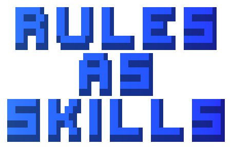

<div align="center">
  <picture>
    <source media="(prefers-color-scheme: dark)" srcset=".github/logo-dark.svg">
    <source media="(prefers-color-scheme: light)" srcset=".github/logo-light.svg">
    
  </picture>
</div>

<div align="center">

[![License: MIT][license-shield]][license-url]
[![Agent Skills][skills-shield]][skills-url]

</div>

<div align="center">
  <a href="#quick-start">Quick Start</a> &middot;
  <a href="#when-to-use">When to Use</a> &middot;
  <a href="#works-best-with">Ecosystem</a>
</div>

> Teach your AI agent what it must never do — as installable, cross-platform skills.

---

## The Problem

AI agents have strong capability delivery (skills, plugins, tools) but weak constraint delivery. You can teach an agent a hundred new tricks — but telling it what it *must not do* is stuck in platform-specific, always-loaded rule files.

If you manage many rules, your system prompt gets bloated. If you have few, important constraints get lost in noise.

## Features

- **Dynamic loading** — constraints load only when the domain is relevant, not on every conversation
- **Cross-platform portability** — one skill works across Claude Code, Cursor, Codex, OpenClaw, and any Agent Skills platform
- **Three-layer safety net** — description (always visible) + body (on demand) + optional platform rule file (hard fallback for critical constraints)
- **Publishable constraints** — share and install MUST/NEVER rules as packages via `npx skills add`
- **Capability + constraint pairing** — `browser-hygiene` (teaches) + `browser-rules` (enforces) work as a complete pair
- **Production-proven patterns** — 6+ rule-skills running in the OpenClaw/Clawfather ecosystem

## Quick Start

### Install

```bash
npx skills add motiful/rules-as-skills
```

Or manually:

```bash
git clone https://github.com/motiful/rules-as-skills ~/.skills/rules-as-skills
ln -sfn ~/.skills/rules-as-skills ~/.claude/skills/rules-as-skills
```

### Create your first rule-skill

Tell your agent:

> "Create a rule-skill for database access. Constraints: MUST use parameterized queries, NEVER write raw SQL, MUST close connections in finally blocks."

Your agent will automatically:
- Apply the three-layer model
- Use the `-rules` naming convention (`database-rules`)
- Structure MUST/NEVER statements with rationale
- Pair it with any existing capability skill

### Publish (optional)

With [Skill-Forge](https://github.com/motiful/skill-forge) installed:

> "Forge this rule-skill to GitHub"

### Auto-discover constraint patterns (optional)

With [Self-Review](https://github.com/motiful/self-review) installed, recurring quality issues are automatically surfaced as rule-skill candidates.

## The Three-Layer Model

```
Layer 1 — Description    MUST/NEVER summary (always visible, ~2% context cost)
Layer 2 — Body           Detailed rules (loaded on demand when relevant)
Layer 3 — Rule File      Platform-native fallback (for critical constraints)
```

- The agent always sees the constraint **exists** (Layer 1 — cheap)
- Full rules load only when **relevant** (Layer 2 — efficient)
- Critical constraints have a **hard fallback** via traditional rules (Layer 3 — safety net)

### Passive vs Active Skills

- **Skills** are **active abilities** — triggered explicitly ("forge this skill", "review my code")
- **Rule-skills** are **passive abilities** — always present in the background, automatically constraining behavior when their domain becomes relevant

A capability skill teaches *how*. A rule-skill ensures *correctly*.

## When to Use

| Scenario | Mechanism |
|----------|-----------|
| Short, universal constraint (<10 lines) | Traditional rule file |
| Domain-specific, complex constraints | Rule-skill |
| Needs cross-platform portability | Rule-skill |
| Critical + must not be missed | Rule-skill + thin rule file fallback |
| Already enforced by code | Neither |

## Proven in Production

6+ rule-skills running in the OpenClaw/Clawfather ecosystem. Key patterns that emerged:

1. **Pre-Action Reading** — "MUST read rules BEFORE acting" forces full constraint loading before action
2. **MUST/NEVER Duality** — every prohibition has a positive counterpart, reducing ambiguity
3. **Immutability Marking** — rule-skills mark themselves as non-modifiable, preventing self-modification loops
4. **Capability + Constraint Pairing** — `browser-hygiene` (teaches) + `browser-rules` (enforces) work together

## Works Best With

| Skill | Why |
|-------|-----|
| [Skill-Forge](https://github.com/motiful/skill-forge) | Publish your rule-skills as installable repos with one command |
| [Self-Review](https://github.com/motiful/self-review) | Auto-discovers patterns worth turning into rule-skills |
| [Memory-Hygiene](https://github.com/motiful/memory-hygiene) | Reference implementation — a constraint skill built with this pattern |

## What's Inside

```
├── SKILL.md              — Three-layer methodology + platform adaptation
└── references/
    ├── anatomy.md        — Structural guide for building rule-skills
    └── decision-tree.md  — Decision framework: rules vs rule-skills
```

## License

MIT

---

Forged with [Skill Forge](https://github.com/motiful/skill-forge) · Crafted with [Readme Craft](https://github.com/motiful/readme-craft)

[license-shield]: https://img.shields.io/github/license/motiful/rules-as-skills.svg
[license-url]: https://github.com/motiful/rules-as-skills/blob/main/LICENSE
[skills-shield]: https://img.shields.io/badge/Agent%20Skills-compatible-blue
[skills-url]: https://agentskills.io
